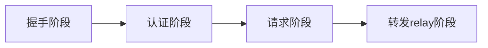
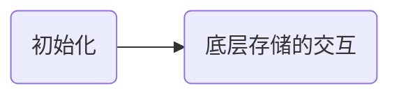
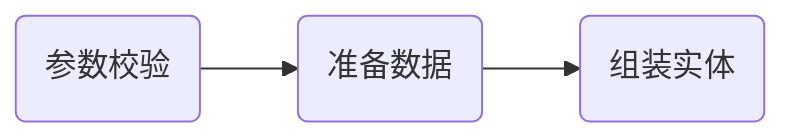
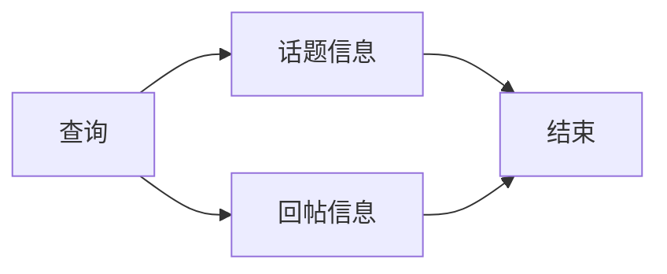
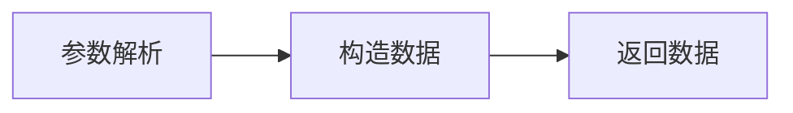

字节跳动青训营笔记
# Go语言快速上手
## 语法速览

### 基础语法

基础语法有几点需要注意：

#### 一：类型

> 有值类型，有指针，指针只能作为引用的替代品，无法指针直接运算。

go语言有值类型，可以直接像下面这样定义变量：

```go
type Student struct {
	name string
	sid  string
}
func main(){
	var student = Student{name: "John", sid: "1001"}   //student为值类型
    var student = &Student{name: "John", sid: "1001"} //student为指针类型（注意由于go有垃圾回收机制，所以这里会自动为我们开辟堆内存
    student := new(Student) //也可通过内置的new()函数直接开辟堆内存，而不立马初始化，得到一个指针
}

```

> go语言的切片

同样切片类型也有上述两种获得内存的定义方式，也可通过内置的make函数对内部的cap和len进行初始的控制。

```cpp
nums := make([]int,2,10)//得到一个底层数组长度为2，cap为10的初始切片
nums1 := nums2[0:3] //第二种切片方式
```

#### 二：内置库部分

##### json库的使用

通过在字段后面跟着的字符串进行序列化的定义，后面跟着的称为域标签。

```cpp
package main

import (
	"encoding/json"
	"fmt"
)

type Student struct {
	Name string `json:"name"`
	Sid  string `json:"sid"`
}

func main() {
	s := Student{Name: "jonh" ,Sid: "10323"}
	//序列化
	p ,err := json.Marshal(s)
	if err!=nil {
		panic(err)
	}
	fmt.Println(string(p))
	
	//反序列化
	err = json.Unmarshal(p,&s)
	if err!=nil {
		panic(err)
	}
	fmt.Println(s)
}

```

官方对域标签有以下说明：

```cpp
// Field appears in JSON as key "myName".
Field int `json:"myName"`

// Field appears in JSON as key "myName" and
// the field is omitted from the object if its value is empty,
// as defined above.
Field int `json:"myName,omitempty"`

// Field appears in JSON as key "Field" (the default), but
// the field is skipped if empty.
// Note the leading comma.
Field int `json:",omitempty"`

// Field is ignored by this package.
Field int `json:"-"`

// Field appears in JSON as key "-".
Field int `json:"-,"`
```

##### 时间库的使用

**时间的获取**

> 获取当前时间：

```go
package main

import (
    "fmt"
    "time"
)

func main() {
    now := time.Now() //获取当前时间
    fmt.Printf("current time:%v\n", now)
    year := now.Year()     //年
    month := now.Month()   //月
    day := now.Day()       //日
    hour := now.Hour()     //小时
    minute := now.Minute() //分钟
    second := now.Second() //秒
    fmt.Printf("%d-%02d-%02d %02d:%02d:%02d\n", year, month, day, hour, minute, second)
}
```

> 获取时间戳

```go
package main

import (
    "fmt"
    "time"
)

func main() {
    now := time.Now()            //获取当前时间
    timestamp1 := now.Unix()     //时间戳
    timestamp2 := now.UnixNano() //纳秒时间戳
    fmt.Printf("现在的时间戳：%v\n", timestamp1)
    fmt.Printf("现在的纳秒时间戳：%v\n", timestamp2)
}
```

> 时间戳与时间的转换

```go
package main

import (
    "fmt"
    "time"
)

func main() {
    now := time.Now()                  //获取当前时间
    timestamp := now.Unix()            //时间戳
    timeObj := time.Unix(timestamp, 0) //将时间戳转为时间格式
    fmt.Println(timeObj)
    year := timeObj.Year()     //年
    month := timeObj.Month()   //月
    day := timeObj.Day()       //日
    hour := timeObj.Hour()     //小时
    minute := timeObj.Minute() //分钟
    second := timeObj.Second() //秒
    fmt.Printf("%d-%02d-%02d %02d:%02d:%02d\n", year, month, day, hour, minute, second)
}
```

> 获取星期几

```go
package main

import (
    "fmt"
    "time"
)

func main() {
    t := time.Now()
    fmt.Println(t.Weekday().String())
}
```

**时间的操作**

（1）Add(during)函数实现某个时间 + 时间间隔

```go
package main
import (
    "fmt"
    "time"
)
func main() {
    now := time.Now()
    later := now.Add(time.Hour) // 当前时间加1小时后的时间
    fmt.Println(later)
}
```

（2）Sub(Time)获取时间差值

返回一个时间段 t - u 的值。如果结果超出了 Duration 可以表示的最大值或最小值，将返回最大值或最小值，要获取时间点 t - d（d 为 Duration），可以使用 t.Add(-d)。

（3）Equal(Time)判断时间是否相同

（4）Before 和 After某个时间是否在他之前或之后

**定时任务**

使用 time.Tick(时间间隔) 可以设置定时器，定时器的本质上是一个通道（channel）

```go
package main
import (
    "fmt"
    "time"
)
func main() {
    ticker := time.Tick(time.Second) //定义一个1秒间隔的定时器
    for i := range ticker {
        fmt.Println(i) //每秒都会执行的任务
    }
}
```

**解析字符串格式的时间**

Parse 函数可以解析一个格式化的时间字符串并返回它代表的时间。

```go
func Parse(layout, value string) (Time, error)
```

与 Parse 函数类似的还有 ParseInLocation 函数。

```go
func ParseInLocation(layout, value string, loc *Location) (Time, error)
```

ParseInLocation 与 Parse 函数类似，但有两个重要的不同之处：

- 第一，当缺少时区信息时，Parse 将时间解释为 UTC 时间，而 ParseInLocation 将返回值的 Location 设置为 loc；
- 第二，当时间字符串提供了时区偏移量信息时，Parse 会尝试去匹配本地时区，而 ParseInLocation 会去匹配 loc。


示例代码如下：

```go
package main
import (
    "fmt"
    "time"
)
func main() {
    var layout string = "2006-01-02 15:04:05"
    var timeStr string = "2019-12-12 15:22:12"
    timeObj1, _ := time.Parse(layout, timeStr)
    fmt.Println(timeObj1)
    timeObj2, _ := time.ParseInLocation(layout, timeStr, time.Local)
    fmt.Println(timeObj2)
}
```

##### 字符串和数字互转

> 字符串与数字互转的想关库函数全在一个包内：strconv包

一图胜千言：


##### os相关信息

> os包里面封装了很多和操作系统相关的内容。

如下：

```go
package main

import (
	"fmt"
	"os"
	"os/exec"
)
func main() {
	fmt.Println(os.Args) //打印命令行参数
	fmt.Println(os.Getenv("PATH")) //打印环境变量
	fmt.Println(os.Setenv("AA","BB")) //设置环境变量，key,val形式设置
	buf,err := exec.Command("grep").CombinedOutput() //执行cmd命令
	if err != nil {
		panic(err)
	}
	fmt.Println(string(buf))
}
```


其他语法pass跳过

## 实战项目

### 猜谜游戏（pass，过于简单）

### 在线词典

> 想要实现在线词典，首先就得用到别人的翻译引擎

#### 第一步：抓包得得到数据进行分析

以彩云词典为例：


从网页调试工具里面查看随时收发的网络数据包，挨个查看它们的response，如果里面的json数据出现翻译结果，那么说明这个包就是返回的翻译结果！

那么我们只需要让go语言来做同样的两件事：

1. 发起请求。
2. 解析返回的json内容。

只要做好了这两件事，那么就很快得到了一个单词的翻译了。

#### 第二步：利用工具生成代码

在此之前我们需要清楚有两个神器般存在的网站：

1. [curlconverter](https://curlconverter.com/#go) 把curl请求直接转为go的请求代码。
2. [oktools](https://oktools.net/json2go) JSON转Golang Struct

那么我们先肯定是要得到请求的代码，然后稍作更改，解析body后得出想要的结果。

###### curl请求直接转为go的请求代码

> 如下图进到刚才我们捕捉到的目标包，然后复制cURL，到网站进行解析得到最终代码。


```go
package main

import (
	"fmt"
	"io/ioutil"
	"log"
	"net/http"
	"strings"
)

func main() {
	client := &http.Client{}
	var data = strings.NewReader(`{"trans_type":"en2zh","source":"hello"}`)
	req, err := http.NewRequest("POST", "https://api.interpreter.caiyunai.com/v1/dict", data)
	if err != nil {
		log.Fatal(err)
	}
	req.Header.Set("Connection", "keep-alive")
	req.Header.Set("sec-ch-ua", `" Not A;Brand";v="99", "Chromium";v="99", "Google Chrome";v="99"`)
	req.Header.Set("sec-ch-ua-mobile", "?0")
	req.Header.Set("User-Agent", "Mozilla/5.0 (Windows NT 10.0; Win64; x64) AppleWebKit/537.36 (KHTML, like Gecko) Chrome/99.0.4844.51 Safari/537.36")
	req.Header.Set("app-name", "xy")
	req.Header.Set("Content-Type", "application/json;charset=UTF-8")
	req.Header.Set("Accept", "application/json, text/plain, */*")
	req.Header.Set("os-type", "web")
	req.Header.Set("X-Authorization", "token:qgemv4jr1y38jyq6vhvi")
	req.Header.Set("sec-ch-ua-platform", `"Windows"`)
	req.Header.Set("Origin", "https://fanyi.caiyunapp.com")
	req.Header.Set("Sec-Fetch-Site", "cross-site")
	req.Header.Set("Sec-Fetch-Mode", "cors")
	req.Header.Set("Sec-Fetch-Dest", "empty")
	req.Header.Set("Referer", "https://fanyi.caiyunapp.com/")
	req.Header.Set("Accept-Language", "zh-CN,zh;q=0.9")
	resp, err := client.Do(req)
	if err != nil {
		log.Fatal(err)
	}
	defer resp.Body.Close()
	bodyText, err := ioutil.ReadAll(resp.Body)
	if err != nil {
		log.Fatal(err)
	}
	fmt.Printf("%s\n", bodyText)
}
```

观察代码的改变我们只需对source部分的内容进行更改，即可得到对应的翻译结果。

###### JSON转Golang Struct

得到翻译结果，body内容后，我们需要把body内容解析为本地的sturct才能正常使用（当然你头铁的话可以直接找对应的字符串即可，也不需要反序列化。

```cpp
type AutoGenerated struct {
	Rc int `json:"rc"`
	Wiki struct {
		KnownInLaguages int `json:"known_in_laguages"`
		Description struct {
			Source string `json:"source"`
			Target interface{} `json:"target"`
		} `json:"description"`
		ID string `json:"id"`
		Item struct {
			Source string `json:"source"`
			Target string `json:"target"`
		} `json:"item"`
		ImageURL string `json:"image_url"`
		IsSubject string `json:"is_subject"`
		Sitelink string `json:"sitelink"`
	} `json:"wiki"`
	Dictionary struct {
		Prons struct {
			EnUs string `json:"en-us"`
			En string `json:"en"`
		} `json:"prons"`
		Explanations []string `json:"explanations"`
		Synonym []string `json:"synonym"`
		Antonym []interface{} `json:"antonym"`
		WqxExample [][]string `json:"wqx_example"`
		Entry string `json:"entry"`
		Type string `json:"type"`
		Related []interface{} `json:"related"`
		Source string `json:"source"`
	} `json:"dictionary"`
}
```

#### 第三步：更改代码实现功能

通过前面生成的代码已经能够实现请求和接收响应，且可以直接把响应内容反序列化为结构体，那么接下来，只需要把想要的部分遍历打印即可。

最终代码如下：

```go
package src

import (
	"bytes"
	"encoding/json"
	"fmt"
	"io/ioutil"
	"log"
	"net/http"
)

func QueryCaiyun(word string) {
	client := &http.Client{}
	request := DictRequestCaiyun{TransType: "en2zh", Source: word}
	buf, err := json.Marshal(request)
	if err != nil {
		log.Fatal(err)
	}
	var data = bytes.NewReader(buf)
	req, err := http.NewRequest("POST", "https://api.interpreter.caiyunai.com/v1/dict", data)
	if err != nil {
		log.Fatal(err)
	}
	req.Header.Set("Connection", "keep-alive")
	req.Header.Set("sec-ch-ua", `" Not A;Brand";v="99", "Chromium";v="99", "Google Chrome";v="99"`)
	req.Header.Set("sec-ch-ua-mobile", "?0")
	req.Header.Set("User-Agent", "Mozilla/5.0 (Windows NT 10.0; Win64; x64) AppleWebKit/537.36 (KHTML, like Gecko) Chrome/99.0.4844.51 Safari/537.36")
	req.Header.Set("app-name", "xy")
	req.Header.Set("Content-Type", "application/json;charset=UTF-8")
	req.Header.Set("Accept", "application/json, text/plain, */*")
	req.Header.Set("os-type", "web")
	req.Header.Set("X-Authorization", "token:qgemv4jr1y38jyq6vhvi")
	req.Header.Set("sec-ch-ua-platform", `"Windows"`)
	req.Header.Set("Origin", "https://fanyi.caiyunapp.com")
	req.Header.Set("Sec-Fetch-Site", "cross-site")
	req.Header.Set("Sec-Fetch-Mode", "cors")
	req.Header.Set("Sec-Fetch-Dest", "empty")
	req.Header.Set("Referer", "https://fanyi.caiyunapp.com/")
	req.Header.Set("Accept-Language", "zh-CN,zh;q=0.9")
	resp, err := client.Do(req)
	if err != nil {
		log.Fatal(err)
	}
	defer resp.Body.Close()
	bodyText, err := ioutil.ReadAll(resp.Body)
	if err != nil {
		log.Fatal(err)
	}
	if resp.StatusCode != 200 { //防止返回错误
		log.Fatal("bad Status code:", resp.StatusCode, "body", string(bodyText))
	}
	var dictResponse DictResponseCaiyun
	err = json.Unmarshal(bodyText, &dictResponse)
	if err != nil {
		log.Fatal(err)
	}

	fmt.Println("translate from Caiyun\n", "UK:", dictResponse.Dictionary.Prons.En, "US:", dictResponse.Dictionary.Prons.EnUs)
	for _, item := range dictResponse.Dictionary.Explanations {
		fmt.Println(item)
	}
}
```

#### homework

后面我依次通过这个方式还弄了其他的翻译引擎，但是有很多翻译引擎的请求头都是动态实时的，或者加了密。我做的第二个有道的翻译引擎使用就是动态实时的，然后去查阅了破解方法，发现是通过阅读原本的js源码进行反推，得出请求头里面动态变化的内容。

最终写了Deepl和有道两个搜索引擎。

源码实现链接：[https://github.com/ACking-you/TraningCamp/tree/master/lesson1/homework/simple_dict/src](https://github.com/ACking-you/TraningCamp/tree/master/lesson1/homework/simple_dict/src)

### SOCKS5代理服务器

#### SOCKS5简单介绍

SOCKS5是代理协议，在使用TCP/IP协议通信的前端机器和服务器之间发挥中介作用，使内部网络的前端机器能够访问互联网的服务器，使通信更加安全。SOCKS5服务器将前端发送的请求转发给真正的目标服务器，模拟前端行为。此处，前端与SOCKS5之间也是通过TCP/IP协议进行通信的，前端向SOCKS5服务器发送请求发送给SOCKS5服务器，然后SOCKS5服务器将请求发送给真正的服务器。SOCKS5服务器在将通讯请求发送给真正服务器的过程中，对于请求数据包本身不加任何改变（明文传输）。SOCKS5服务器在收到真实服务器响应后，也原样转发到前端。

它的用途是， 比如某些企业的内网为了确保安全性，有很严格的防火墙策略，但是带来的副作用就是访问某些资源会很麻烦。 socks5 相当于在防火墙开了个口子，让授权的用户可以通过单个端口去访问内部的所有资源。实际上很多翻墙软件，最终暴露的也是一个 socks5 协议的端口。

#### SOCKS5代理原理


正常浏览器访问一个网站，如果不经过代理服务器的话，就是先和对方的网站建立 TCP 连接，然后三次握手，握手完之后发起 HTTP 请求，然后服务返回 HTTP 响应。如果设置代理服务器之后，流程会变得复杂一些。 首先是浏览器和 socks5 代理建立 TCP 连接，代理再和真正的服务器建立 TCP 连接。这里可以分成四个阶段，**握手阶段、认证阶段、请求阶段、 relay 阶段**。

* 握手阶段：浏览器会向 socks5 代理发送请求，包的内容包括一个协议的版本号，还有支持的认证的种类，socks5 服务器会选中一个认证方式，返回给浏览器。如果**返回的是 00 的话就代表不需要认证**，返回其他类型的话会开始认证流程，这里我们就不对认证流程进行概述了。（本次课程跳过认证阶段）
*  请求阶段：认证通过之后浏览器会对 socks5 服务器发起请求。主要信息包括 版本号，请求的类型，一般主要是 connection 请求，就代表代**理服务器要和某个域名或者某个 IP 地址某个端口建立 TCP 连接**。代理服务器收到响应之后，会真正和后端服务器建立连接，然后返回一个响应。
*   relay 阶段：此时浏览器会发送 正常发送请求，然后代理服务器接收到请求之后，会直接把请求转换到真正的服务器上。然后如果真正的服务器以后返回响应的话，那么也会把请求转发到浏览器这边。然后实际上 **代理服务器并不关心流量的细节**，可以是 HTTP流量，也可以是其它 TCP 流量。  这个就是 socks5 协议的工作原理。




#### 具体实现

##### v1-简单echo服务器

```go
package main

import (
	"bufio"
	"fmt"
	"log"
	"net"
)

func main() {
	server, err := net.Listen("tcp", "0.0.0.0:1080")
	if err != nil {
		panic(err)
	}
	for {
		client, err := server.Accept()
		if err != nil {
			log.Printf("Accept failed %v", err)
			continue
		}
		fmt.Printf("连接成功! clent:%v \n", client.RemoteAddr())
		go process(client)
	}
}

func process(conn net.Conn) {
	defer func() {
		conn.Close()
		fmt.Printf("连接断开! clent:%v \n", conn.RemoteAddr())
	}()

    //用缓冲流进行一次包装，减少底层IO次数，让读取效率更高效
	reader := bufio.NewReader(conn)
	for {
		b, err := reader.ReadByte()
		if err != nil {
			break
		}
		_, err = conn.Write([]byte{b})
		if err != nil {
			break
		}
	}
}
```

**客户端验证：**

没必要再写一个客户端，这时完全可以netcat工具进行tcp连接测试。

如下：


##### v2-实现SOCKS5的握手阶段

实现SOCKS5之前我们需要清楚SOCKS5的握手阶段的请求和返回是怎么样的，如下面的图表所示：

| VER                        | NMETHODS                                   | METHODS                                 |
| -------------------------- | ------------------------------------------ | --------------------------------------- |
| 1byte                      | 1byte                                      | 1 to 255 byte                           |
| 协议版本信息*socks5为0x05* | 支持认证的方法数量*值为0x00则表示无需认证* | NMETHODS的值为多少METHODS就有多少个字节 |

```go
package main

//auth 阶段
import (
	"bufio"
	"fmt"
	"io"
	"log"
	"net"
)
const(
	socks5Ver = 0x05
	cmdBind = 0x01
	atypIPV4 = 0x01
	atypeHOST = 0x03
	atypeIPV6 = 0x04
)
func main() {
	server, err := net.Listen("tcp", "0.0.0.0:1080")
	if err != nil {
		panic(err)
	}
	for {
		client, err := server.Accept()
		if err != nil {
			log.Printf("Accept failed %v", err)
			continue
		}
		fmt.Printf("连接成功! clent:%v \n", client.RemoteAddr())
		go process(client)
	}
}

func process(conn net.Conn) {
	defer func() {
		conn.Close()
		fmt.Printf("连接断开! clent:%v \n", conn.RemoteAddr())
	}()

	reader := bufio.NewReader(conn)
	err := auth(reader,conn)
	if err!=nil{
		log.Printf("client %v auth failed:%v",conn.RemoteAddr(),err)
	}
	log.Println("auth success")
}

func auth(reader *bufio.Reader, conn net.Conn) (err error) {
	//协议版本
	ver,err := reader.ReadByte()
	if err != nil{
		return fmt.Errorf("read ver failed:%w",err)
	}
	if ver != socks5Ver{
		return fmt.Errorf("not supported ver:%v",ver)
	}

	//支持的方法数量
	methodSize,err := reader.ReadByte()
	if err!=nil{
		return fmt.Errorf("read methodSize failed:%w",err)
	}
	//方法值
	method := make([]byte,methodSize)
	_,err = io.ReadFull(reader,method)
	if err!=nil{
		return fmt.Errorf("read method failed %w",err)
	}
	log.Println("ver",ver,"method",method)

	//返回的内容表示SOCKS5通信，且无需认证
	_,err = conn.Write([]byte{socks5Ver,0x00})
	if err !=nil{
		return fmt.Errorf("write failed:%w",err)
	}
	return nil
}

```

##### v3-实现SOCKS5的请求阶段

同样来看看此时的消息协议：

客户端请求：

| VER                  | CMD                               | RSV                | ATYP                           | DST.ADDR                           | DST.PORT                 |
| -------------------- | --------------------------------- | ------------------ | ------------------------------ | ---------------------------------- | ------------------------ |
| 1byte                | 1byte                             | 1byte              | 1byte                          | Variable                           | 2byte                    |
| 协议版本0x05为SOCKS5 | 代表请求类型*0x01表示CONNECT请求* | 保留字段（不理会） | 目标地址类型（IPV4/IPV6/域名） | 地址值，根据不同地址类型，长度不同 | 需要访问的服务器的端口号 |

服务端响应：

| VER                  | REP                   | RSV                | ATYP                       | BIND.ADDR              | BIND.PORT              |
| -------------------- | --------------------- | ------------------ | -------------------------- | ---------------------- | ---------------------- |
| 1byte                | 1byte                 | 1byte              | 1byte                      | Variable               | 2byte                  |
| 协议版本0x05为SOCKS5 | 代表响应。成功就返回0 | 保留字段（不理会） | 地址类型（IPV4/IPV6/域名） | 地址值（这里暂时不需要 | 端口号（这里暂时不需要 |


> 这一过程的代码：


> 对当前的实现进行测试：

进行如下curl命令：

```shell
curl --socks5 localhost:1080 -v http://www.qq.com
```

此时请求会失败，但我们已经能看到正常打印出来的ip和端口号

##### v4-实现SOCKS5的转发阶段（最终完全版本

最后的转发过程，由于不需要对流量进行任何的处理，所以没有上层协议，直接再Write操作完后把流量进行转发即可。

对于两个连接流量的转发，标准库里有有一些好用的函数库。

1. 通过net.Dial建立tcp连接。

   ```go
   dest, err := net.Dial("tcp", fmt.Sprintf("%v:%v", addr, port))
   if err != nil {
       return fmt.Errorf("dial dst failed:%w", err)
   }
   defer dest.Close()
   ```

2. 标准库的 io.copy 可以实现一个单向数据转发，双向转发的话，需要启动两个 goroutinue。

   ```go
   go func() {
       _, _ = io.Copy(dest, reader)
       cancel()
   }()
   go func() {
       _, _ = io.Copy(conn, dest)
       cancel()
   }()
   ```


现在有一个问题，connect 函数会立刻返回，返回的时候连接就被关闭了。需要等待任意一个方向copy出错的时候，再返回 connect 函数。

> 这个context目前还弄不明白

这里可以使用到标准库里面的一个 context 机制，用 context 连 with cancel 来创建一个context。 在最后等待 ctx.Done() ， 只要 cancel 被调用， ctx.Done就会立刻返回。 然后在上面的两个 goroutinue 里面 调用一次 cancel 即可。

##### 验证

> 同样是以下请求命令此时终于返回正常内容了！

```shell
curl --socks5 localhost:1080 -v http://www.qq.com
```


现在SOCKS5代理服务器程序已经写好，可以使用[SwitchyOmega](https://chrome.google.com/webstore/detail/proxy-switchyomega/padekgcemlokbadohgkifijomclgjgif?hl=zh-CN)插件对该代理服务器进行正式的使用（可以用连接了学校内网的电脑，作为SOCKS5代理服务器对学校内网的内容进行访问(￣▽￣)"

# Go语言工程实践

## 并发和Goroutine

### 并发和并行的区别

并发可能更多的是精确到语言的逻辑，也就是直接的多线程，或者多进程。

而并行则是一种表述程序运行的方式，就如同异步和同步的描述。

并发程序不一定是并行的，这个看操作系统的调度。

### 线程与协程的区别

线程：是比进程更小粒度的运行单位，存在于内核态，需要操作系统来调度，内存消耗是MB级别。

协程：是比线程更小的粒度，通过m:n的比例在一个线程中再细分出来的单位，存在于用户态，用户可以自由调度，内存消耗是KB级别。

协程对比线程的优势：

1. 存在于用户态，可操作性强，调度可由自己控制。
2. 更轻量，所需资源更少。

### Goroutine

go语言的go关键字跑的就是协程，我们称为goroutine。
> 关于协程背后更多的故事，可以看这个视频 [go协程实现原理](https://www.bilibili.com/video/BV1hv411x7we?p=16) ，我们这里只讲简单使用。

#### 用法

简单用法如下：

```go
package main

import (
	"fmt"
	"sync"
)

func hello(i int) {
	println("hello world : " + fmt.Sprint(i))
}

func main() {
    //go的风格来说一般都喜欢运行一个闭包
    go func(j int) {
        hello(j)
    }(i)
}
```

#### 并发的通信

> 并发程序之间的通信，一般都是通过共享内存的形式实现通信，临界区一般需要加锁保护。


而go语言采取的是通过通信来实现共享内存，这个过程是反过来的，但用起来更为直观。

##### Channel


通过内置函数 make 可以得到两种类型的 channel 。

**注意**：channel是类似于引用的一个类型，如果直接通过var声明定义是没法初始化得到内部内存的，故记得通过make创建channel。还有就是记得不用的时候关闭。

**channel的使用**

>  channel的简单使用如下：

```go
func main() {
	var src chan int
	src = make(chan int)//不带缓冲
	dest := make(chan int, 3)//带缓冲
	go func() {
		defer close(src)
		for i := 0; i < 10; i++ {
			src <- i//生产
		}
	}()
	go func() {
		defer close(dest)
		for i := range src {//消费者1
			dest <- i * i
		}
	}()
	for i := range dest {//消费者2
		println(i)
	}
}
```

**使用带缓冲channel的好处**

在一个生产者消费者模型中，生产者的生产效率远高于消费者，那么可以使用带缓冲的channel，防止生产者因为等待消费者消费过程而产生阻塞。反之对消费者来说也是受用的。

#####  并发安全

**互斥锁**

go语言并没有对加锁机制的弃用，标准库里面仍然有sync.Mutex。

以下为简单加锁实现并发安全：

```go
package main

import (
	"fmt"
	"sync"
	"time"
)
var(
	x int
	mut sync.Mutex
)
func AddWithLock() {
	mut.Lock()
	for i:=0;i<2000;i++ {
		x++
	}
	mut.Unlock()
}

func AddWithoutLock()  {
	for i:=0;i<2000;i++ {
		x++
	}
}

func main() {
	//开五个协程的锁版本，再打印最终结果
	for i := 0; i < 5; i++ {
		go AddWithoutLock()
	}
	//等待上面的协程执行结束
	time.Sleep(time.Second)
	fmt.Println(x)

	//有锁版本
	x = 0
	for i:=0;i<5;i++{
		go AddWithLock()
	}
	time.Sleep(time.Second)
	fmt.Println(x)
}

```


**计数器**

WaitGroup，通过Add(a)计时器+a，通过Done()计数器-1，通过Wait()阻塞直到计数器为0。这个东西我觉得有些类似于操作系统的信号量。

以下为实例：

```go
package main

import (
	"fmt"
	"sync"
)

func hello(){
	fmt.Println("hello")
}
func main() {
	var wg sync.WaitGroup
	wg.Add(5)
	for i := 0; i < 5; i++ {
		go func() {
			defer wg.Done()
			hello()
		}()
	}
	wg.Wait()
}

```


------

## 依赖管理

Go依赖管理的演进：


### GOPATH

go语言有一个内置的全局环境变量GOPATH，指定了GOPATH文件夹后，他会在这个文件夹内创建以下三个文件夹：

|——bin：项目编译的二进制文件

|——pkg：项目编译的中间产物，加速编译

|——src：项目源码

项目直接依赖src下的代码，go get命令下载的软件包都会在src目录下。

#### GOPATH弊端


当我们对某个依赖进行升级后，则项目A依赖的版本可能无法实现兼容，这就是GOPATH无法解决的**多版本控制问题**。

### Go Vendor

为了解决多版本控制问题，go又增加了Go Vendor的方式来管理依赖。

使用govendor init 在项目根目录会生成vendor文件夹，其中存放了当前项目依赖的副本。在Vendor机制下，如果当前项目存在Vendor目录，会优先使用该目录下的依赖，如果依赖不存在，会从GOPATH中寻找；这样解决了更新GOPATH依赖源码后之前的版本不兼容的问题。

#### Go Vendor弊端

弊端很明显，无法解决依赖的依赖。

同样还是无法解决依赖的冲突。


归根到底vendor不能很清晰的标识依赖的版本概念。

### Go Module （最终解决方案

特点：

* 通过 go.mod 管理依赖包版本。
* 通过 go get/mod 工具管理依赖包。

最终目标：定义版本规则和管理项目的依赖关系。

#### 依赖管理三要素

1. 配置文件，描述依赖 （对应go.mod）
2. 中心仓库管理依赖库   （GoProxy）
3. 本地工具              go get/mod

##### 配置文件


每个依赖单元用模块路径+版本来唯一标示。

###### 版本规则


gopath和govendor都是源码副本方式依赖，没有版本规则概念，而gomod为了放方便管理则定义了版本规则。

对于语义化版本有如下规则：

* MAJOR：表示是不兼容的 API，所以即使是同一个库，MAJOR 版本不同也会被认为是不同的模块。
* MINOR：通常是新增函数或功能，向后（向下）兼容。
* PATCH：修复 bug。

###### 杂项

版本号后面添加 `//indirect` 表示间接依赖。

**选择题**


选择1.4，因为它向后兼容。

#### 中心仓库管理依赖库

##### 依赖的分发


如果直接向代码托管平台进行依赖的请求，很快会发现有以下这些问题：

* 无法保证构建的稳定性（可能代码仓库的所有者更改删除了包版本
* 无法保证可用性
* 增加了平台压力

为了很好的解决以上依赖分发的问题，go采用Proxy进行代理分发。


Go Proxy 是一个服务站点，它会缓源站中的软件内容，缓存的软件版本不会改变，并且在源站软件删除之后依然可用。

###### 较为神奇的地方

Go语言通过设置环境变量GOPROXY来设置具体的服务站点。可以通过逗号设置多个Proxy站点，最后如果这几个都没有找到，那么会通过direct进行回源，也就是回到本来的请求站点，而不是代理站。有意思的是，当你此时从源站下载好依赖后，你之前走过的Proxy站点也会将这个缓存下来。


**有趣的实践**

通过go mod init创建一个项目，写好后提交到GitHub仓库里，然后通过go get对你的代码进行请求，注意最后回源的direct要加上，否则肯定get不到，最后你会发现你的Proxy站上，也有了你的代码🥳

你会发现这样的过程，让go语言的代码仓库非常的繁荣，各种库都可以go get得到！

#### 本地工具

> go get命令


> go mod命令


------


## 测试

### 为什么要测试？

测试是避免事故发生的最后一道关口！


### 测试类型


* 回归测试：是指修改了旧代码后，重新测试以确认修改没有引入新的错误或导致其他代码产生错误。
* 集成测试：集成测试的目的是在集成这些不同的软件模块时揭示它们之间交互中的缺陷。
* 单元测试：单元测试测试开发阶段，开发者对单独的函数、模块做功能验证。

层级从上至下，测试成本逐渐减低，而测试覆盖率确逐步上升，所以单元测试的覆盖率一定程度上决定这代码的质量。

### 单元测试

#### go单测的规则


#### go单测实例

> 写了一个json解析的单测

json.go

```go
package attention

import (
	"bytes"
	"encoding/json"
	"fmt"
)

func NumUnmarshal() {
	jsonStr := `{"id":1,"name":"Jerry"}`
	var res map[string]interface{}
	_ = json.Unmarshal([]byte(jsonStr), &res)
	fmt.Printf("%T\n", res["id"])
	i := res["id"].(int64)
	fmt.Println(i)
}

func NumDecode() {
	jsonStr := `{"id":1,"name":"Jerry"}`
	var res map[string]interface{}
	decoder := json.NewDecoder(bytes.NewReader([]byte(jsonStr)))
	decoder.UseNumber()
	_ = decoder.Decode(&res)
	i, _ := res["id"].(json.Number).Int64()
	fmt.Println(i)
}
```

json_test.go

```go
package attention

import "testing"

func TestNumUnmarshal(t *testing.T) {
	NumUnmarshal()
}

func TestNumDecode(t *testing.T) {
	NumDecode()
}
```

> 测试结果：通过 go test 会执行这个软件包里面所有的测试。如果需要执行特定的测试在后面跟上这个测试的go文件名以及对应的测试文件名。


#### 单元测试框架

go语言常见的测试框架有testfy。在go mod文件里面的require部分填上以下代码便可通过`go mod download`进行下载。

```http
github.com/stretchr/testify v1.7.1
```

或者直接 go get这个包也行。

这个包里包含测试常用的断言。

> 基础用法如下，更多用法请去查看官方文档。


#### 衡量单元测试的标准


##### 代码覆盖率

需要在测试时展示代码覆盖率可以通过添加--cover命令行参数。

下面是我的一次带代码覆盖率的单元测试结果：


我们可以看到百分比的覆盖率，也就是本次测试经过的代码块占比。

被测试到的代码都变成了绿色。


### 打桩测试

在打桩测试前，我们先了解单侧的稳定性和幂等性。


* 稳定：稳定是指相互隔离，能在任何时间，任何环境，运行测试。
* 幂等：幂等是指每一次测试运行都应该产生与之前一样的结果。

如果在有外部依赖的情况下进行单测，换一个测试环境，那么这个外部依赖信息可能会发生变化，比如需要打开某个文件，如果你把这个给别人测试，那么在他本地的文件路径肯定就不一致。这就完全没法符合稳定和幂等两个条件。

如下代码：


那么我们如何解决这样的问题呢？

我们通过打桩来解决这个问题。

所谓打桩就是通过你指定的行为来对原本的行为替换，到计算机语言里面来讲就是通过你定义的桩函数把原本的函数进行替换，这就是打桩。

> 那打桩有什么用呢？

* 隔离：将测试任务从产品项目中分离出来，使之能够独立编译、链接，并独立运行。

* 补齐：用桩来代替未实现的代码，例如，函数A调用了函数B，而函数B由其他程序员编写，且未实现，那么，可以用桩来代替函数B，使函数A能够运行并测试。

* 控制：控制是指在测试时，人为设定相关代码的行为，使之符合测试需求。

>  go语言的打桩实现原理：
>
> 在运行时通过通过 Go 的 unsafe 包，将内存中函数的地址替换为运行时函数的地址。 将待打桩函数或方法的实现跳转到。

打桩更改后的测试：


### 基准测试（Benchmark）

很多时候我们需要清楚代码的运行效率，这个时候，我们就需要对代码进行基准测试了。

基准测试需要遵循以下语法规定：

1. go语言中的基准测试也是基于单元测试，所以还是需要遵循 `*_test.go` 的命名规则。
2. 用于基准测试的函数名必须以Benchmark开头。
3. 函数的入参需要是 `*testing.B` 。

#### 具体例子

##### 代码分析

负载均衡中随机选择执行服务器。

`server_select.go`

```go
package benchmark

import (
	"github.com/bytedance/gopkg/lang/fastrand"
	"math/rand"
)

var ServerIndex [10]int

// InitServerIndex 初始化服务器的描述符
func InitServerIndex() {
	for i:=0;i<10;i++{
		ServerIndex[i] = i+100
	}
}

// RandSelect 随机选择一个服务器
func RandSelect() int  {
	return ServerIndex[rand.Intn(10)]
}

// FastRandSelect 用外部的fast包
func FastRandSelect()int{
	return ServerIndex[fastrand.Intn(10)]
}
```

`server_select_test.go`

```go
package benchmark

import "testing"

func BenchmarkSelect(b *testing.B){
	InitServerIndex()
	b.ResetTimer()
	for i:=0;i<b.N;i++{
		RandSelect()
	}
}

func BenchmarkSelectParallel(b *testing.B) {
	InitServerIndex()
	b.ResetTimer()
	b.RunParallel(func(pb *testing.PB) {
		for pb.Next(){
			FastRandSelect()
		}
	})
}
```

> 我们对Benchmark的代码进行以下讲解：
>
> 1. 对一个测试用例的默认测试时间是 1 秒，当测试用例函数返回时还不到 1 秒，那么 testing.B 中的 N 值将按 1、2、5、10、20、50……递增，并以递增后的值重新进行用例函数测试。
> 2. Resttimer重置计时器，我们在reset之前做了init或其他的准备操作，这些操作不应该作为基准测试的范围。
> 3. runparallel是多协程并发测试。

##### 代码效率分析


我们发现，多线程的测试反而效率更慢了！

主要原因是rand为了保证全局的随机性和并发安全，持有了一把全局锁。

这里贴了字节实现的较为快速的随机数实现库：[fastrand](github.com/bytedance/gopkg/lang/fastrand)

安装这个库也很简单，下面一行命令即可：

```go
go get github.com/bytedance/gopkg/lang/fastrand
```

**优化代码**

通过把 rand 替换为 fastrand 后，重新测试结果如下：


我们发现多线程的效率与之前的效率相比，提升了百倍！

> fastrand主要的实现思路是牺牲了一定的数列一致性，在大多数场景是适用的，同学在后面遇到随机的场景可以尝试用一下。

------


## 项目实战

### 需求描述

- [x] 展示话题（标题，文字描述）和回帖列表
- [x] 暂不考虑前端页面实现，仅实现一个本地的web服务
- [x] 话题和回帖数据用文件存储

> 用户浏览


> 实例图


### 项目分层结构


* 数据层：Repository 数据**Model**，**封装外部数据的增删改查**，并将数据初步反序列化，且需要直接与底层的数据存储形式打交道，比如存储形式是文件，还是数据库，还是微服务等等。
* 逻辑层：Service 业务**Entity**，这里会利用数据层得到封装好的数据再次封装得到更贴近客户端请求的数据，同样也需要写好增删改查，但这里的增删改查并不会与真正的外部数据打交道，也就是说Service层不关心底层数据的存储形式，只关心**核心业务输出**。
* 视图层：Controller 视图View，**处理和外部的交互逻辑**，也就是说，这个层级也是依赖于上一个层级的数据，它负责真正和客户端交互的过程，只关心返回什么样的数据给客户端，而前面两个层级都是为这个层级做的铺垫。

### 代码实现

> 代码实现可以到[TraningCamp](https://github.com/ACking-you/TraningCamp)查看lesson2源码（温馨提示github域名后加上1s可以有意想不到的源码阅读体验哦

#### Repository层实现

> 主要实现底层存储数据序列化到具体的结构体上，以及对应的增删改查。

一般经过以下过程：



* 初始化：主要是对数据的准备，或者时数据库的连接的初始化。
* 底层存储的交互：如果数据库，那么就是对数据库发起请求得到对应的Model，如果是文件存储，那么数据应该已经初始化到内存，直接进行取值即可。

##### 数据映射

由于本次的存储实现采取的是文件存储，故需要每次一次性把文件读取好并完成数据的反序列化。这里用到的map进行映射数据方便查询。

> 如果是数据库，这时应该通过一些orm框架直接进行数据的增删改查映射，但在此之前还是得连接数据库（初始化过程


> 具体源码实现（我多加了一个记录最后一个Id的，方便完成id的不重复生成


##### 数据的增删改查

**topic.go**

> 实现对话题的增删改查，这里用到了一个结构体+方法的方式去实现，且用sync.Once实现单例，我觉得好处在于：
>
> 1. 防止重名。
> 2. 方便记忆，方便调用时进行对应的语法补全（比如想要对Topic进行操作，只需要想到TopicDao这个即可补全后续的操作


**post.go**

> 和前面的实现类似，这里我完成了**homework**，添加了AddPost方法以及对应的将数据插入到文件的方法，由于可能出现多个客户端同时发起post请求，这时我们需要对数据进行并发安全的保护，这里我使用的Mutex加锁的方式。


#### Service层实现

> 主要是对Repository层的Modle进行进一步的封装成更上层需要的Entity。

一般经过以下流程：



* **参数校验**：由于是和上层通信的层，上层调用得到数据时，首先**需要传入对应的参数，那么我们需要对这个参数进行校验，**不同的方法需要的参数是不同的，需要进行的校验也是不同的，比如本项目查询的方法和插入的方法，需要的参数就不同，所以对应的也是走的这三个流程。
* **准备数据**：在正式组装得到整个实体之前，我们应该先进行数据的准备，也就是需要把零件得到，当然，不一次性组装好的原因，我认为更重要的是这样可以**减少代码的耦合**，这样一来准备每个数据的过程可以独立开，且可以进行针对性的优化，或者进行局部的修改，也不会直接对组装代码造成影响。
* **组装实体**：把准备好的数据返回即可。

为了实现上述过程，我们建立一个结构体，保存准备的数据，且把整个组装实体的过程流程化。

> 结构体如下：

```go
// PageInfo 一个页面的信息包括，topic和它上面的post言论
type PageInfo struct {
	Topic    *repository.Topic
	PostList []*repository.Post
}

// QueryPageInfoFlow 为了防止高耦合度的构造PageInfo，可以构造如下结构体实现流式处理
type QueryPageInfoFlow struct {
	topicId  int64
	pageInfo *PageInfo

	topic *repository.Topic
	posts []*repository.Post
}
```

> 整个组装过程：

```go
// Do 整个组装过程
func (q *QueryPageInfoFlow) Do() (*PageInfo, error) {
	//对id进行合法性验证
	if err := q.checkNum(); err != nil {
		return nil, err
	}
	//准备好生成PageInfo的数据
	if err := q.prepareInfo(); err != nil {
		return nil, err
	}
	//打包最终的PageInfo
	if err := q.packPageInfo(); err != nil {
		return nil, err
	}
	return q.pageInfo, nil
}
```


##### 参数校验

> 由于这个查询过程暂时只需要校验这一个参数

```go
func (q *QueryPageInfoFlow) checkNum() error {
	if q.topicId <= 0 {
		return errors.New("topic must larger than 0")
	}
	return nil
}
```

##### 准备数据

> 由于两个数据的查询毫无关联，可以通过并行处理。




```go
//这两个过程，由于是毫无关联的，可以用go协程进行并发处理
func (q *QueryPageInfoFlow) prepareInfo() error {
	var wg sync.WaitGroup
	wg.Add(2)
	//获取Topic
	go func() {
		defer wg.Done()
		q.topic = repository.NewTopicDao().QueryTopicFromId(q.topicId)
	}()
	//获取Posts
	go func() {
		defer wg.Done()
		q.posts = repository.NewPostDao().QueryPostsFromParentId(q.topicId)
	}()

	wg.Wait()
	return nil
}
```

##### 组装实体

```go
//更新最终的PageInfo
func (q *QueryPageInfoFlow) packPageInfo() error {
	q.pageInfo = &PageInfo{
		Topic:    q.topic,
		PostList: q.posts,
	}
	return nil
}

```

> 这样的话实现整个QueryPageInfo函数就只需要调用这个结构体的方法即可。
>
> 如下：

```go
func QueryPageInfo(id int64) (*PageInfo, error) {
	return NewQueryPageInfoFlow(id).Do()
}
```

#### Controller层实现

> 这个层级是真正对客户端发来的请求进行直接响应的层级，直接与客户端交互。

一般经过以下过程：



* **参数解析**：由于对接的数据直接是上层收到的信息，所以大概率是纯字符串，所以需要先对参数进行解析。
* **构造数据**：也就是构造响应的数据，一般来说除了直接的数据外，还需要提供一个错误码和错误信息给前端。
* **返回数据**：根据不同情况构造的不同数据直接返回即可。

##### 具体代码

```go
// PageData 最终发送给客户端的json数据对应的结构体，我们需要错误码，以及对应错误码对应的消息，最后再是数据(用空接口实现泛型
type PageData struct {
	Code int64       `json:"code"`
	Msg  string      `json:"msg"`
	Data interface{} `json:"data"`
}

// QueryPageINfo 真正和客户端进行交互的函数，需要注意客户端发来的流量都是字符串形式
func QueryPageINfo(topicIdStr string) *PageData {
	pageId, err := strconv.Atoi(topicIdStr)
	if err != nil {
		return &PageData{Code: 1, Msg: err.Error(), Data: nil}
	}
	pageInfo, err := service.QueryPageInfo(int64(pageId))
	if err != nil {
		return &PageData{Code: 2, Msg: err.Error(), Data: nil}
	}
	return &PageData{Code: 0, Msg: "success", Data: pageInfo}
}

```

#### homework部分

##### 作业内容与思考

课后实战：

* 支持发布帖子。
* 本地Id生成保证不重复。
* Append文件，更新索引，注意并发安全问题。

> 我发现一个特点，这种分Controller、Service、Repository层的情况，
>
> 当你上层调用**查询**接口的时候，**数据是自下往上的**，也就是数据是从下往上依次封装。
>
> 而如果是实现**添加操作**接口的时候，**数据是自上往下的**，则数据是从上往下依次封装。

##### 具体实现

> 思路：
>
> 1. Id生成唯一性，是用的一个lastIndexId保存整个post中最大的id，之后每次添加post都继续增加这个lastIndexId来得到新的id。
> 2. 并发安全问题，用到Mutex加锁临界区即可。

###### Repository层

> AddPost提供是提供给Service层的接口。
>
> 需要实现把数据添加到map里以及append到文件中（对应fileDataInsertPost函数）

```go
func (d *PostDao) AddPost(post *Post) error {
	//加锁保证同时请求的并发安全
	lock := sync.Mutex{}
	lock.Lock()
	posts, ok := postIndexMap[post.ParentId]
	if !ok {
		return errors.New("post invalid,not exist parent id")
	}
	//注意更新map里的数据，go切片并不像C++里的Vector，可能append后操作的就不是同一片 底层数组了

	postIndexMap[post.ParentId] = append(posts, post)
	err := fileDataInsertPost("./lesson2/homework/data/", post)
	if err != nil {
		return err
	}

	lock.Unlock()
	return nil
}

func fileDataInsertPost(filePath string, post *Post) error {
	open, err := os.OpenFile(filePath+"post", os.O_WRONLY|os.O_APPEND, 0666)
	if err != nil {
		return err
	}
	writer := bufio.NewWriter(open)

	data, err := json.Marshal(*post)
	if err != nil {
		return err
	}
	writer.WriteString("\r\n")
	writer.Write(data)
	writer.Flush()
	return nil
}
```

###### Service层实现

> 之前实现的流程基本一致，先校验上层传来的参数，数据准备过程换成数据的发布（publish）过程，将得到的数据封装好后再传给下层（**我们发现这个数据的组织过程和查询是反着的**

```go
package service

import (
	"errors"
	"github.com/ACking-you/TraningCamp/lesson2/homework/repository"
	"time"
	"unicode/utf8"
)

func PublishPost(topicId, userId int64, content string) (int64, error) {
	return NewPublishPostFlow(topicId, userId, content).Do()
}

func NewPublishPostFlow(topicId, userId int64, content string) *PublishPostFlow {
	return &PublishPostFlow{
		userId:  userId,
		content: content,
		topicId: topicId,
	}
}

type PublishPostFlow struct {
	userId  int64
	content string
	topicId int64

	postId int64
}

func (f *PublishPostFlow) Do() (int64, error) {
	if err := f.checkParam(); err != nil {
		return 0, err
	}
	if err := f.publish(); err != nil {
		return 0, err
	}
	return f.postId, nil
}

func (f *PublishPostFlow) checkParam() error {
	if f.userId <= 0 {
		return errors.New("userId id must be larger than 0")
	}
	if utf8.RuneCountInString(f.content) >= 500 {
		return errors.New("content length must be less than 500")
	}
	return nil
}

func (f *PublishPostFlow) publish() error {
	post := &repository.Post{
		ParentId:   f.topicId,
		UserId:     f.userId,
		Content:    f.content,
		CreateTime: time.Now().Unix(),
	}
	repository.LastPostId++
	post.Id = repository.LastPostId
	if err := repository.NewPostDao().AddPost(post); err != nil {
		return err
	}
	f.postId = post.Id
	return nil
}

```

###### Controller层

> 和之前的Query处理过程是完全一致的，解析参数-->构造内容-->返回内容

```go
package controller

import (
	"strconv"

	"github.com/ACking-you/TraningCamp/lesson2/homework/service"
)

func PublishPost(uidStr, topicIdStr, content string) *PageData {
	//参数转换
	uid, _ := strconv.ParseInt(uidStr, 10, 64)

	topic, _ := strconv.ParseInt(topicIdStr, 10, 64)
	//获取service层结果
	postId, err := service.PublishPost(topic, uid, content)
	if err != nil {
		return &PageData{
			Code: 1,
			Msg:  err.Error(),
		}
	}
	return &PageData{
		Code: 0,
		Msg:  "success",
		Data: map[string]int64{
			"post_id": postId,
		},
	}
}

```


### 实测结果

#### 服务端代码

**server.go**

```go
package main

import (
	"github.com/ACking-you/TraningCamp/lesson2/homework/controller"
	"github.com/ACking-you/TraningCamp/lesson2/homework/repository"
	"gopkg.in/gin-gonic/gin.v1"
	"os"
	"strings"
)

//最后再通过gin框架搭建服务器

func main() {
	//准备数据
	if err := Init("./lesson2/homework/data/"); err != nil {
		os.Exit(-1)
	}

	//注册路由
	
	r := gin.Default()
	r.GET("me:id", func(c *gin.Context) {
		topicId := c.Param("id")
		topicId = strings.TrimLeft(topicId, ":,")
		println(topicId)
		data := controller.QueryPageINfo(topicId)
		c.JSONP(200, data)
	})

	r.POST("/post/do", func(c *gin.Context) {
		uid, _ := c.GetPostForm("uid")
		println(uid)
		topicId, _ := c.GetPostForm("topic_id")
		println(topicId)
		content, _ := c.GetPostForm("content")
		println(content)
		data := controller.PublishPost(uid, topicId, content)
		c.JSON(200, data)
	})
	err := r.Run()
	if err != nil {
		return
	}
}

func Init(filepath string) error {
	err := repository.Init(filepath)
	if err != nil {
		return err
	}
	return nil
}
```

#### 请求结果

> 使用的是goland里面的http请求工具进行的。

##### GET请求测试（成功）

请求报文如下：

```http
GET http://localhost:8080/me:1
Accept: application/json
```

返回报文如下：

```http
HTTP/1.1 200 OK
Content-Type: application/json; charset=utf-8
Date: Mon, 09 May 2022 05:17:28 GMT
Content-Length: 426

{
  "code": 0,
  "msg": "success",
  "data": {
    "Topic": {
      "id": 1,
      "title": "青训营来啦!",
      "content": "小姐姐，快到碗里来~",
      "create_time": 1650437625
    },
    "PostList": [
      {
        "id": 1,
        "parent_id": 1,
        "content": "小姐姐快来1",
        "create_time": 1650437616,
        "user_id": 1
      },
      {
        "id": 2,
        "parent_id": 1,
        "content": "小姐姐快来2",
        "create_time": 1650437617,
        "user_id": 2
      },
      {
        "id": 3,
        "parent_id": 1,
        "content": "小姐姐快来3",
        "create_time": 1650437618,
        "user_id": 13
      }
    ]
  }
}

Response code: 200 (OK); Time: 174ms; Content length: 368 bytes

```

##### POST请求测试（成功）

请求报文：

```http
POST http://localhost:8080/post/do
Content-Type: application/x-www-form-urlencoded

uid=2&topic_id=1&content=测试内容嗨嗨嗨嗨
```

返回报文：

```http
HTTP/1.1 200 OK
Content-Type: application/json; charset=utf-8
Date: Mon, 09 May 2022 05:22:38 GMT
Content-Length: 47

{
  "code": 0,
  "msg": "success",
  "data": {
    "post_id": 5
  }
}

Response code: 200 (OK); Time: 103ms; Content length: 47 bytes
```

再看看文件里面的内容是否添加：


成功！
